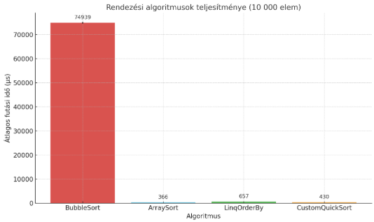

[🔗 GitHub repó](https://github.com/Ricsi19/performance_test)

# Rendezési algoritmusok teljesítménymérése C#-ban

Ez a projekt különböző rendezési algoritmusok teljesítményét méri össze a `BenchmarkDotNet` könyvtár segítségével. A cél az volt, hogy összehasonlítsuk a beépített és kézzel írt algoritmusok hatékonyságát nagy adathalmazon.

## Mért algoritmusok

- `BubbleSort`: Klasszikus, oktatási célokra használt algoritmus
- `Array.Sort`: A .NET által biztosított optimalizált gyorsrendezés
- `QuickSort`: Ez egy saját, általam készített rekurzív gyorsrendezés
- `LINQ OrderBy`: A LINQ által biztosított deklaratív rendezés

## Mérés körülményei

- **Gép**: i7-1185G7, 16GB RAM, WIN11
- **Platform**: .NET 8.0
- **Konfiguráció**: `Release` build, `x64` platform
- **BenchmarkDotNet** verzió: 0.13.10
- **Adathalmaz mérete**: 10 000 elem (véletlenszerűen permutált)

## Reprodukálhatóság

A pontos eredményekhez fontos, hogy:

- A kódot `Release` módban fordítsuk
- Ugyanazon gépen és környezetben futtassuk
- Az adatokat minden mérés előtt inicializáljuk ugyanúgy
- Ugyanazokat a csomagokat és verziókat használjuk

## Eredmények

| Algoritmus         | Átlagos idő (µs) |
|--------------------|------------------|
| BubbleSort         | 74,938.7             |
| Array.Sort         | 366.4               |
| QuickSort (custom) | 657.4               |
| LINQ OrderBy       | 429.8               |


## Grafikon

A mérések alapján készült grafikon:  


## Futtatás

```bash
dotnet run -c Release
